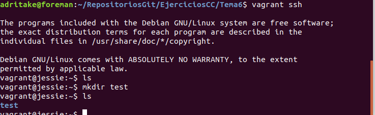

# Ejercicios del tema 6: Orquestación
## Previo
Para instalar vagrant en mi ordenador me he descargado la última versión de linux de esta [página](https://www.vagrantup.com/downloads.html). Es un archivo binario que se debe ejecutar en la localización que esté ubicado. Para poder ejecutarlo como un programa instalado normalmente con apt-get lo he movido a una localización distinta y he modificado el archivo de alias de bash *~/.bash_aliases* añadiendo la siguiente línea: `alias vagrant=/home/adritake/Adrian/Utiles/vagrant`. Si escribo `vagrant -v` me aparece su versión que es *Vagrant 2.2.2*.
También es necesario tener instalado virtual box.

## Ejercicio 1. Instalar una máquina virtual Debian usando Vagrant y conectar con ella.

- Buscamos en la [página de box](https://www.vagrantbox.es/) de vagrant una imagen debian.
- Yo voy a usar la imágen *debian/jessie64*: `vagrant init debian/jessie64`
- `vagrant up` para crear la MV con esa imagen en Virtual Box.
- Para conectarte con ssh a la MV basta con escribir `vagrant ssh`. Yo he obtenido lo siguiente:


## Ejercicios 3 y 4. Crear un script para provisionar de forma básica una máquina virtual para el proyecto que se esté llevando a cabo en la asignatura. Configurar tu máquina virtual usando vagrant con el provisionador ansible

No se ha creado el script puesto que hay que modificar el vagrant file para que provisione con ansible y no sé como solucionarlo. Se ha hecho lo siguiente:

- Inicializar vagrant con una imagen de ubuntu: `vagrant init ubuntu/trusty64`.
- Se usa el [playbook](https://github.com/adritake/CC_UGR_Personal/blob/master/provision/MyPlaybook.yml) de mi repositorio de la asignatura solo que he tenido que ponerle que haga todo con permisos de super usuario.
- Se modifica e vagrant file añadiendo las siguientes líneas:
```
config.vm.provision "ansible" do |ansible|
    ansible.verbose = "v"
    ansible.playbook = "playbook.yml"
end
```
- Creamos la vm y la provisionamos con `vagrant up`
- Tras mucho rato la máquina se ha provisionado correctamente.
